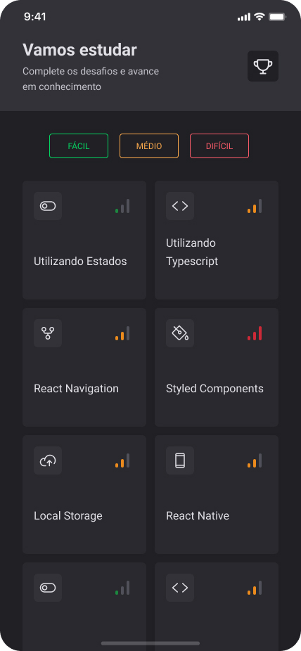
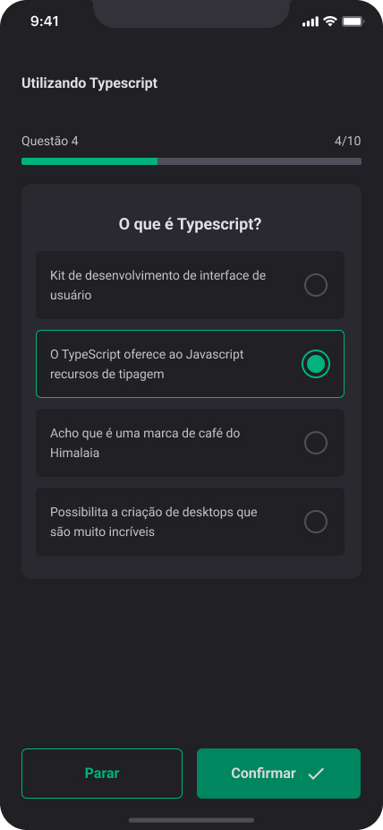
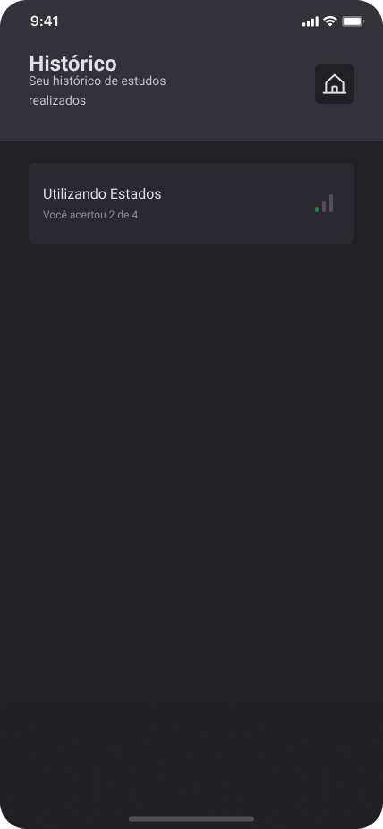

# Ignitequiz

Ignitequiz is a quiz app for programming enthusiasts. It was built using Expo and React Native, with a focus on incorporating animations, microinteractions, and visual, tactile sound feedback to enhance the user experience.

## Table of Contents

- [Features](#features)
- [Installation](#installation)
- [Usage](#usage)
- [Screenshots](#screenshots)
- [Technologies](#technologies)
- [Disclaimer](#disclaimer)

## Features

- Quiz questions about programming
- Animations and microinteractions to enhance the user experience
- Visual, tactile sound feedback to provide a more immersive experience

## Installation

To get started with Ignitequiz, you'll need to have Node.js and Expo CLI installed on your machine. Once you have those installed, 
you can clone the repository and install the dependencies:

1. `git clone https://github.com/your-username/ignitequiz.git`
2. cd ignitequiz
3. `npm install`

Once the dependencies are installed, you can start the development server:

4. `expo start`

## Usage

1. Start the app `expo start`

2. Use your mobile device to scan the QR code displayed in the terminal or in the Expo Dev Tools.

3. The app should now be running on your device.

## Screenshots

Here are some screenshots of the project:

    
Click to view images

    <h2>Home</h2>
    
    <h2 style="margin-top: 50px">Quiz</h2>
    
    <h2 style="margin-top: 50px">Quiz Conclusion</h2>
    
    <h2 style="margin-top: 50px">History </h2>
    

## Technologies

- React Native
- Expo
- @expo-google-fonts/roboto
- @react-native-async-storage/async-storage
- @react-navigation/native
- @react-navigation/native-stack
- @shopify/react-native-skia
- expo-font
- expo-status-bar
- phosphor-react-native
- react
- react-dom
- react-native
- react-native-gesture-handler
- react-native-reanimated
- react-native-safe-area-context
- react-native-screens
- react-native-svg
- react-native-web
- expo-av
- expo-haptics
- @babel/core
- @types/react
- @types/react-native
- react-native-svg-transformer
- typescript

## Disclaimer

This project's design and code was provided by [@Rocketseat](https://github.com/Rocketseat) as part of the Ignite course. In this project I developed animations, microinteractions and some user feedbacks to improve user's experience.  